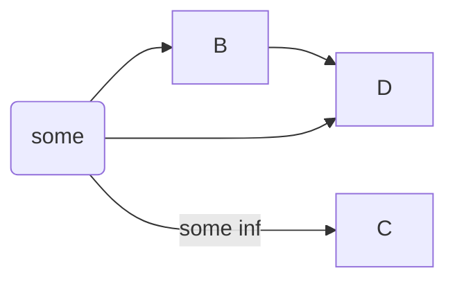
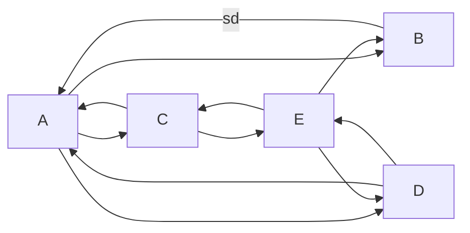
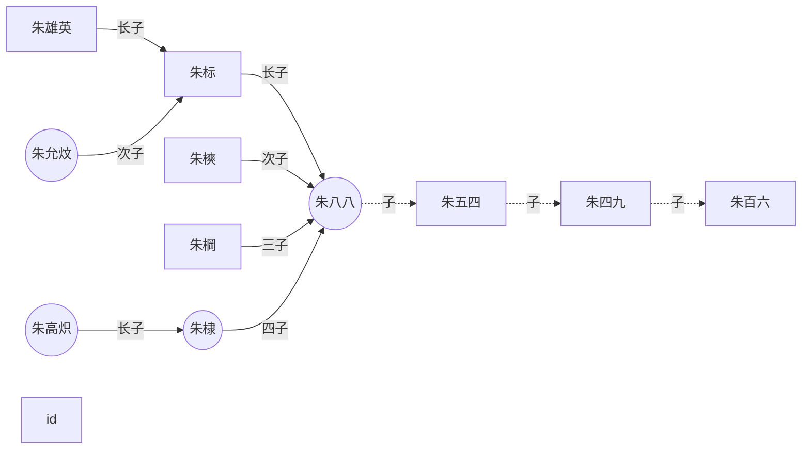
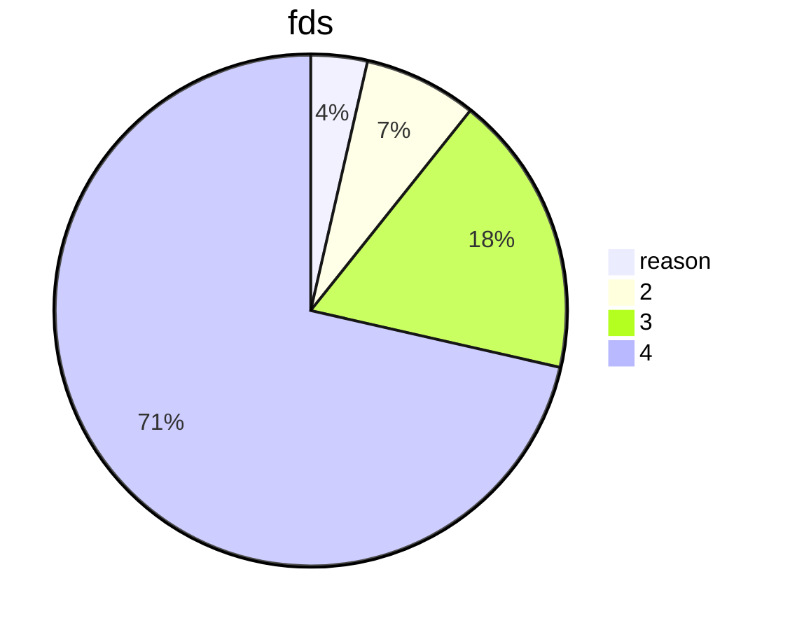

# 流程图


```flow js

```


```mermaid
graph LR

A(some)-->B
A--some info-->C
B-->D
A-->D


```



```mermaid
graph LR;
A--> B & C & D;
B--> |sd| A;
C--> A & E;
D--> A & E;
E--> B & C & D;
```


```mermaid
graph LR
emperor((朱八八))-.子.->朱五四-.子.->朱四九-.子.->朱百六


朱雄英--长子-->朱标--长子-->emperor
emperor2((朱允炆))--次子-->朱标
朱樉--次子-->emperor
朱棡--三子-->emperor
emperor3((朱棣))--四子-->emperor
emperor4((朱高炽))--长子-->emperor3
    id
```



```mermaid
pie 
  title fds
  "reason" : 10
  "2": 20
  "3": 50
  "4": 200
```