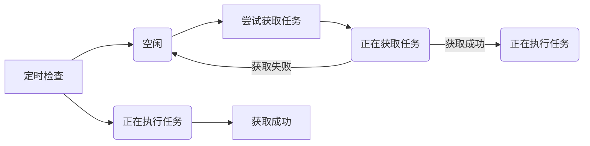
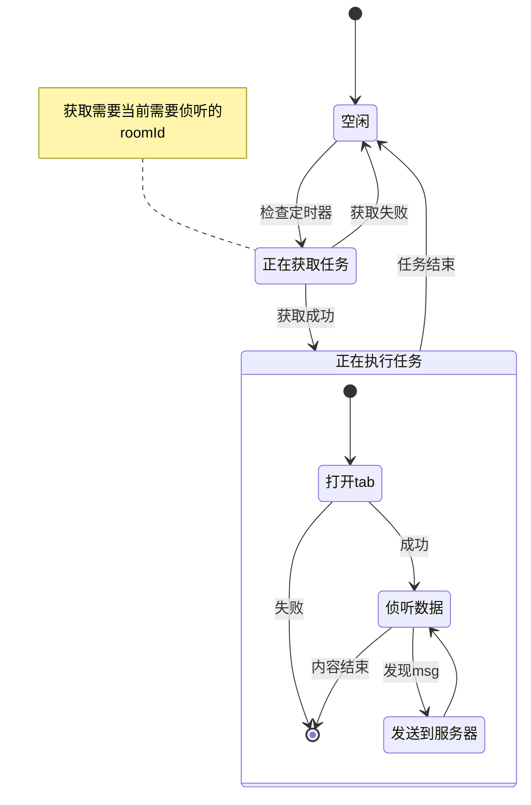
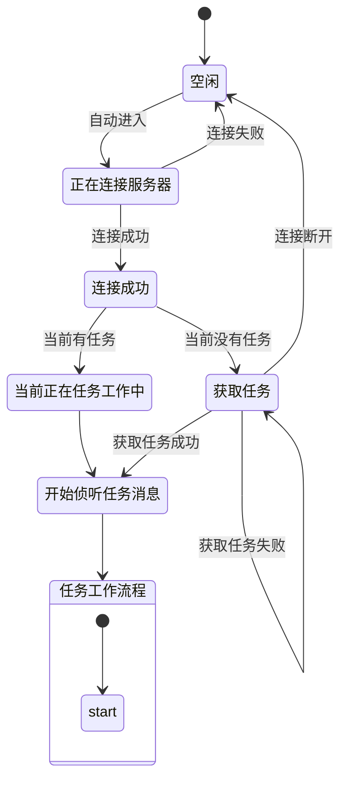
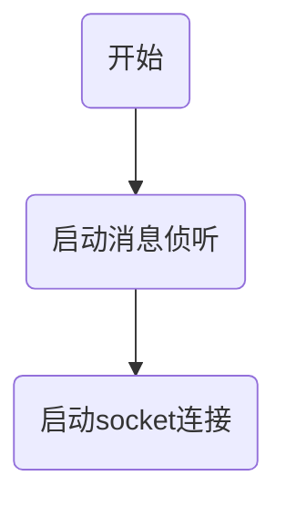
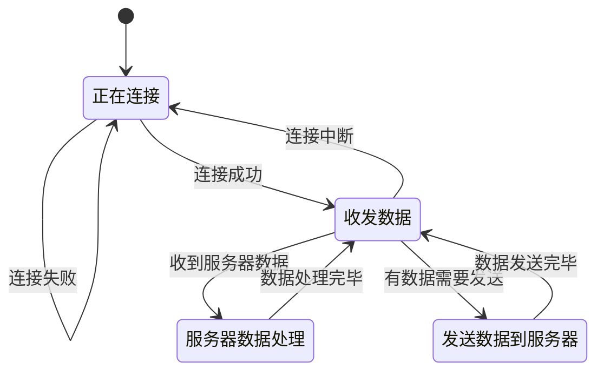
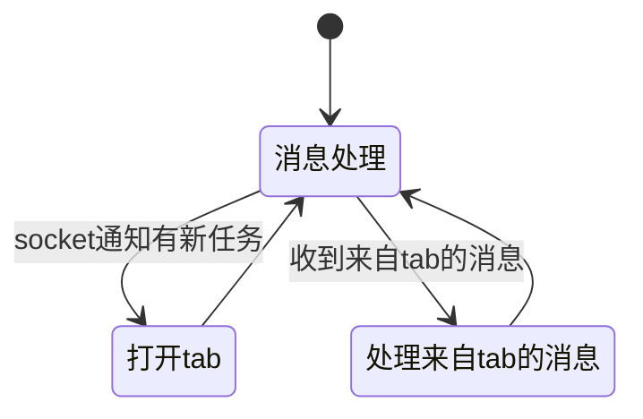
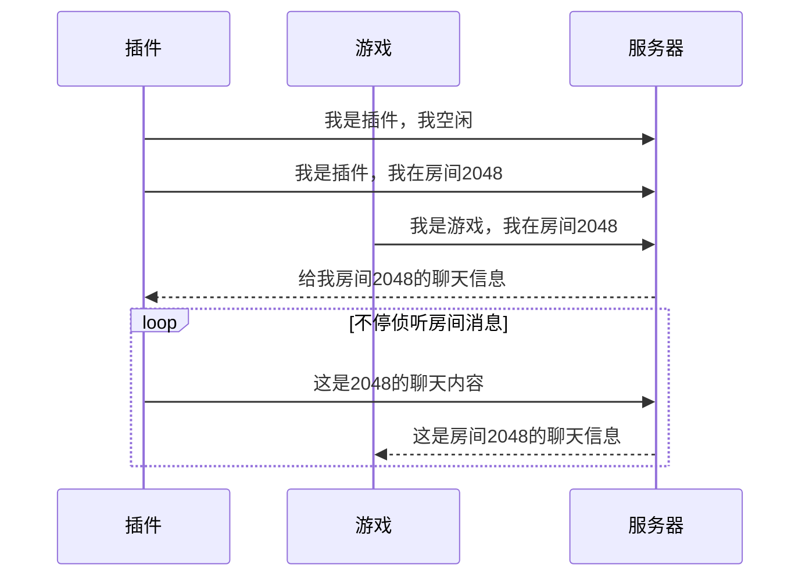

# 流程图

> crx
> 
> 自动连接服务器，并按照服务器的指示进行操作。
> 
>> 根据roomId获取msg并告知服务器。
> 
>> 使用user身份进入room并按照服务器需求发言。
> 
> 
> 
 

> client
> 
> 自动连接服务器，并获取服务器数据。

> control
> 
> 要求用户使用user身份在room发言。

> server
> 
> 调度crx和client

tr

background

socket

tab管理

时序图

