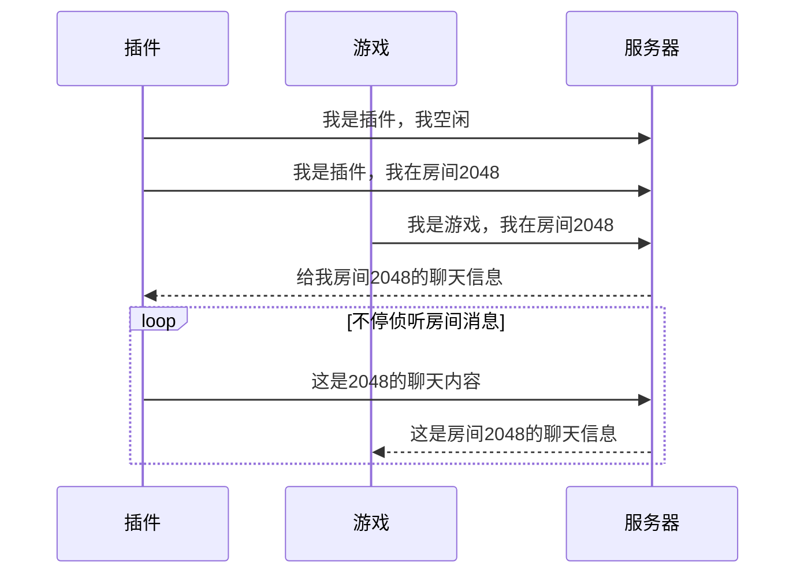

# 首页

[创建chrome插件](./docs/crx/create.md)

[测试一下mermaid流程图](./docs/crx/flow.md)

[创建基于ts+webpack的chrome插件项目](./docs/ts/crx-ts.md)

时序图

```mermaid
sequenceDiagram

    participant crx as 插件
    participant game as 游戏
    participant server as 服务器

    crx->>server: 我是插件，我空闲
    crx->>server: 我是插件，我在房间2048
    game->>server: 我是游戏，我在房间2048
    server-->>crx: 给我房间2048的聊天信息
    loop 不停侦听房间消息
        crx->>server: 这是2048的聊天内容
        server-->>game: 这是房间2048的聊天信息
    end


```